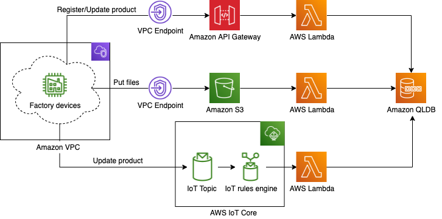

## Deprecation Notice
This AWS Solution has been archived and is no longer maintained by AWS. To discover other solutions, please visit the [AWS Solutions Library](https://aws.amazon.com/solutions/).

# Tamper Proof Quality Data Using Amazon QLDB
The Tamper Proof Quality Data Using Amazon QLDB is a solution that demonstrates how to inhibit customers from tampering with important data such as product quality data in manufuctuaring companies leveraging blockchain technology.

Please refer to [Implementation Guide](https://docs.aws.amazon.com/solutions/latest/tamper-proof-quality-data-using-amazon-qldb/welcome.html) for the detail of this solution.

## Table of contents
- [Tamper Proof Quality Data Using Amazon QLDB](#tamper-proof-quality-data-using-amazon-qldb)
  - [Table of contents](#table-of-contents)
  - [Architecture overview](#architecture-overview)
  - [Deployment](#deployment)
  - [Development](#development)
    - [Project structure](#project-structure)
    - [Running unit tests](#running-unit-tests)
    - [Running a local build](#running-a-local-build)
  - [Usage](#usage)

## Architecture overview


## Deployment
The solution is deployed using a CloudFormation template or CDK project. For details on deploying the solution please see the details on the solution home page: [Tamper Proof Quality Data Using Amazon QLDB](https://aws.amazon.com/solutions/implementations/tamper-proof-quality-data-using-amazon-qldb/)

## Development
### Project structure

```
├── deployment
│   └── cdk-solution-helper  [Lightweight helper that cleans-up synthesized templates from the CDK]
└── source
    ├── bin                  [Entrypoint of the CDK application]
    ├── img                  [Images used in the documents]
    ├── lambda               [Code for the Lambda functions]
    │   ├── helper           [Utility code for each Lambda function]
    │   ├── lib              [Common utility code]
    │   └── test             [Unit tests for Lambda functions]
    ├── lib                  [Constructs and stacks for the components of the solution]
    └── test                 [Unit tests for CDK code]
```

### Running unit tests
You can run unit tests for both CDK and Lambda code by the following commands:

```sh
cd source
npm ci
sh ./run-all-tests.sh
```

### Running a local build
This project uses [AWS Cloud Development Kit](https://aws.amazon.com/cdk/) to build and deploy AWS resources.
Please setup and bootstrap CDK first. [The document is here.](https://docs.aws.amazon.com/cdk/latest/guide/getting_started.html)

After setting up CDK, run the commands below:

```sh
cd source
npm ci
npx cdk synth
```

## Usage
As shown in the architecture diagram, there're three input ways in this solution.
1. Amazon API Gateway
2. Amazon S3
3. AWS IoT core

Please refer to [Implementation Guide](https://docs.aws.amazon.com/solutions/latest/tamper-proof-quality-data-using-amazon-qldb/welcome.html) for the detailed usage of these inputs.

---

Copyright 2020-2021 Amazon.com, Inc. or its affiliates. All Rights Reserved.

Licensed under the Apache License, Version 2.0 (the "License");
you may not use this file except in compliance with the License.
You may obtain a copy of the License at

    http://www.apache.org/licenses/LICENSE-2.0

Unless required by applicable law or agreed to in writing, software
distributed under the License is distributed on an "AS IS" BASIS,
WITHOUT WARRANTIES OR CONDITIONS OF ANY KIND, either express or implied.
See the License for the specific language governing permissions and
limitations under the License.removed api and email
